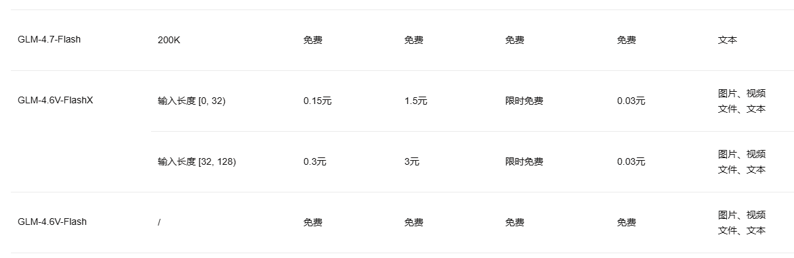
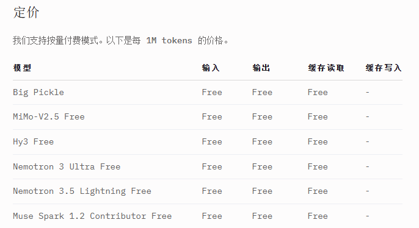
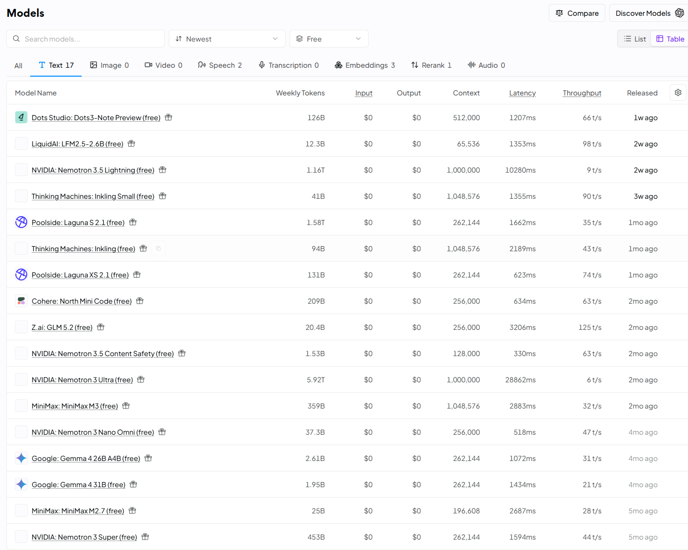
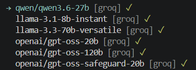

# free api

1. glm: https://bigmodel.cn/pricing，但是不显示GLM-4.7-Flash和GLM-4.6V-Flash，只能自己配置custom，但是经常请求太大，体验不好

2. opencode zen: https://opencode.ai/docs/zh-cn/zen/

3. openrouter: https://openrouter.ai/models?variant=free&output_modalities=text

4. amd: https://developer.amd.com.cn/radeon/

5. nvidia: https://build.nvidia.com/ 原本的qq邮箱，谷歌邮箱都需要手机号验证码，收不到

6. groq: https://console.groq.com/ 需要科学上网 也是拷贝一次就不能查看了 使用都是Error: 403: {"message":"Forbidden"}

